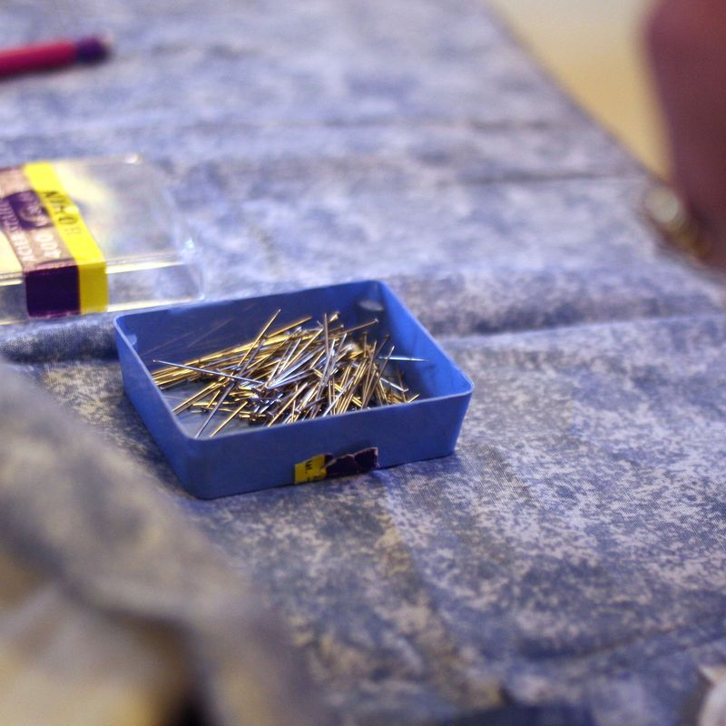
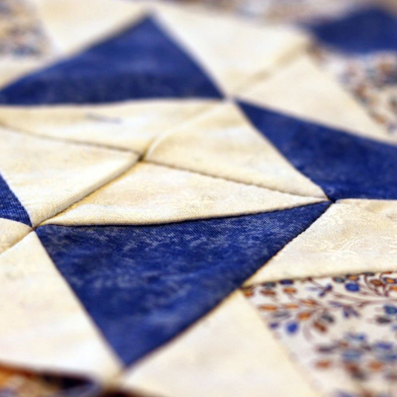

## Présentation ##

Cet atelier est destiné à toutes celles qui ont envie de réaliser des ouvrages décoratifs

Tout est possible avec des points, des carrés, des quilts et surtout beaucoup de minutie

Il convient de préparer des gabarits — choisir des tissus — assembler des blocs — donner du relief et ceci avec des points réguliers et nombreux — et surtout trouver l'équilibre des couleurs pour mieux harmoniser les tissus.

## Modalités ##

De septembre à juin : un mercredi tous les 15 jours de 9h à 12h : selonun calendrier préétabli en début d'année avec l'animatrice et les participants.  
Les cours sont animés par une animatrice bénévole qui a une longue expérience des techniques et qui transmet des conseils avisés.

## Inscriptions ##

Auprès de l’association ASN  
L'adhésion à l'association s'élève à 20€ par an ; et la participation pour les frais de la location de la salle à 10€ par an.

La reprise des cours aura lieu le mercredi 27 septembre 2017.

	 
	<ul class="thumbnails">
		<li class="span2">
			
		</li>                                                               
		<li class="span2">                                                  
			
		</li>                                                               
		<li class="span2">                                                  
			
		</li>                                                               
		<li class="span2">                                                  
			
		</li>                                                               
		<li class="span2">                                                  
			
		</li>                                                               
		<li class="span2">                                                  
			
		</li>
	</ul>
	Voir le <a href="slide-patchwork.html">diaporama des ateliers de patchwork</a>.

