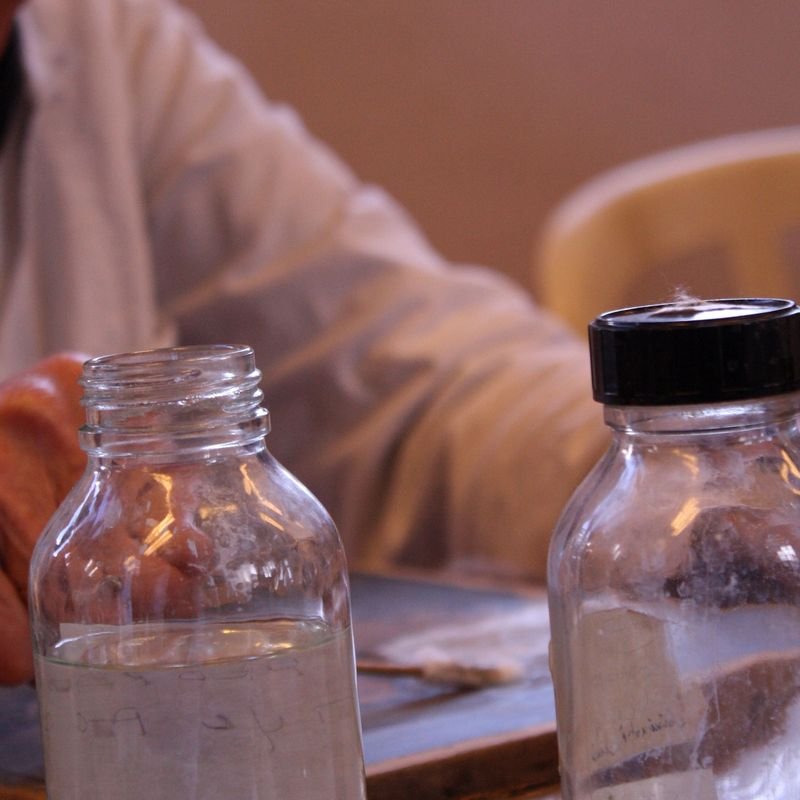
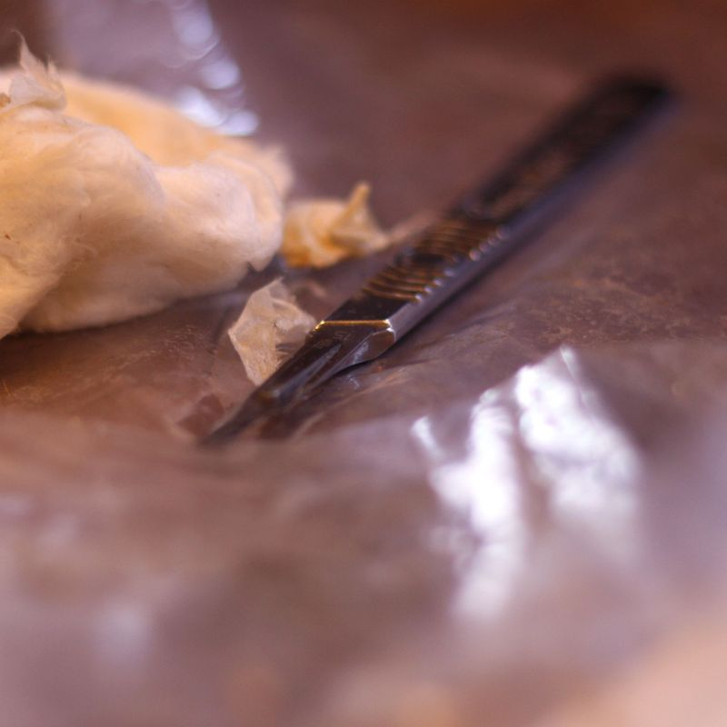
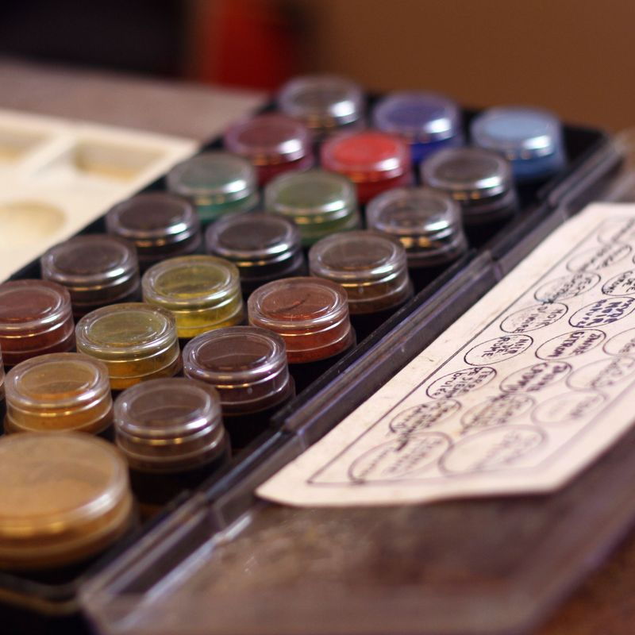
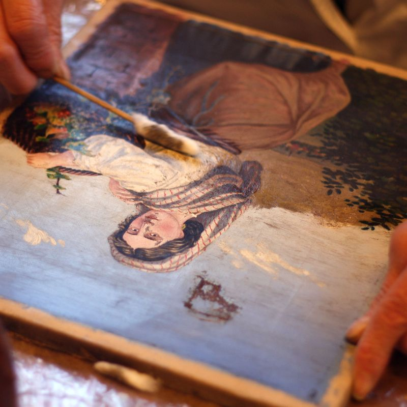

## Présentation ##

A l’atelier vous trouvez une solution adaptée à l’état de conservation de votre œuvre à restaurer

Un vernis altéré, une toile distendue…. Et l’examen attentif va permettre de rechercher les moyens techniques les plus appropriés à mettre en œuvre : nettoyage – dévernissage – masticage – rentoilage  puis remise en couleur…

Le tableau retrouve toute sa valeur.

## Modalités ##

Un vendredi tous les 15 jours de 9 h à 17 h  
Les cours sont animés par une animatrice bénévole, spécialiste de la restauration de tableaux, qui transmet son savoir faire.

## Inscriptions ##

Auprès de l’association

*Coût :* 40 € par an — (Adhésion : 20 € et frais de location de salle : 20 €)

Reprise des cours le vendredi 6 octobre 2017.

	 
	<ul class="thumbnails">
		<li class="span2">
			
		</li>                                                                        
		<li class="span2">                                                           
			
		</li>                                                                        
		<li class="span2">                                                           
			
		</li>                                                                        
		<li class="span2">                                                           
			
		</li>                                                                        
		<li class="span2">                                                           
			
		</li>                                                                        
		<li class="span2">                                                           
			
		</li>
	</ul>
	Voir le <a href="slide-restauration-tableaux.html">diaporama des ateliers de restauration de tableaux</a>.

