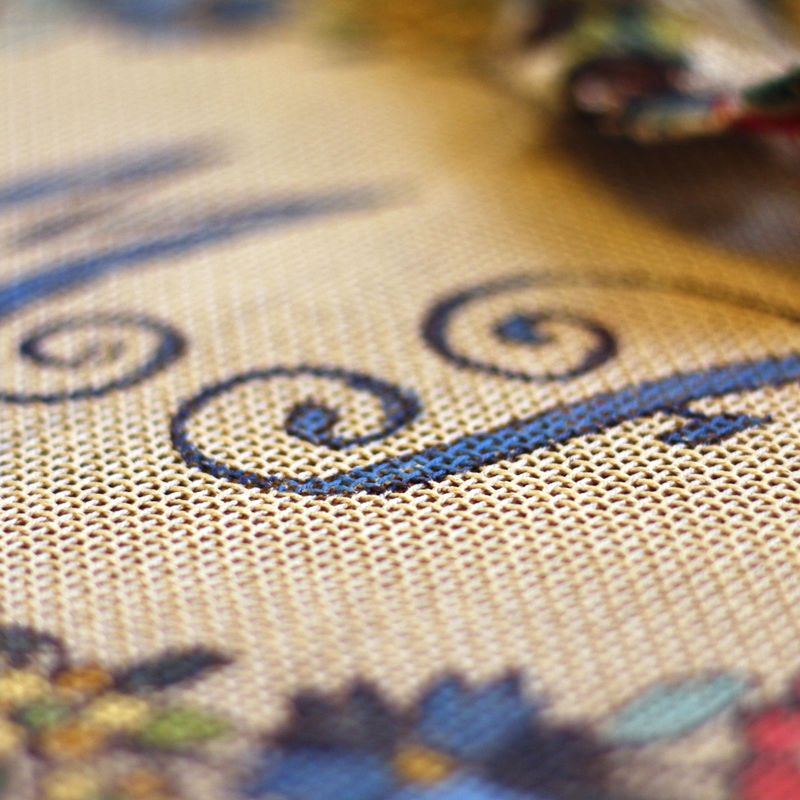
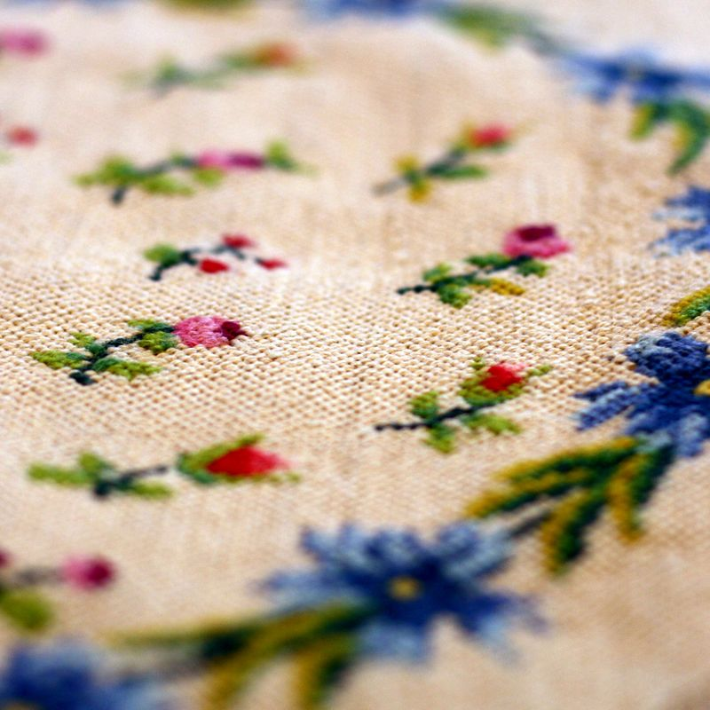

##Présentation##

Venez découvrir cet art ancestral qui a traversé les âges.
Vous pouvez travailler sur une reproduction de tapisserie ancienne, un modèle de fresque ou une création…

L’étape  principale consiste à bien choisir le matériel nécessaire : le canevas – les fils selon leur épaisseur. Puis de fil en aiguille, de point en point, vous faites vivre le canevas avec toutes ses couleurs.
Et ceci dans une ambiance conviviale.

##Modalités##

De septembre à juin, un mercredi tous les 15 jours de 9 h à 12 h ; selon un calendrier établi en début d’année. L’animateur expérimenté dispense ses conseils.

##Inscriptions##

Auprès de l’association ASN

*Coût :* 30 € par an (adhésion et location de salle)
Cours à régler directement à l’animateur : 185 € par an

Reprise des cours le mercredi 23 septembre 2015.

	 
	<ul class="thumbnails">
		<li class="span2">
			
		</li>                                                                         
		<li class="span2">                                                            
			
		</li>                                                                         
		<li class="span2">                                                            
			
		</li>                                                                         
		<li class="span2">                                                            
			
		</li>                                                                         
		<li class="span2">                                                            
			
		</li>                                                                         
		<li class="span2">                                                            
			
		</li>
	</ul>
	Voir le <a href="slide-tapisserie-aiguille.html">diaporama des ateliers de tapisserie à l'aiguille</a>.

